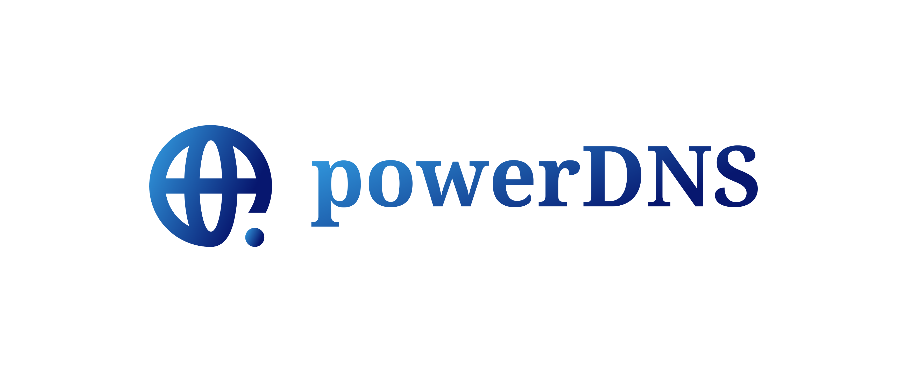
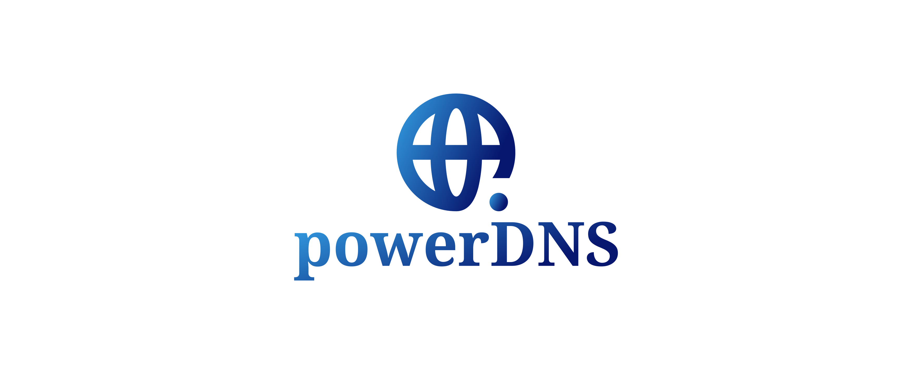

# logo
Logotyp powerDNS

## Font

Font in use <a target="_blank" href="https://www.fontsquirrel.com/fonts/droid-serif">DroidSerif-Bold</a> designed by
<a target="_blank" href="https://twitter.com/@SteveMatteson1">Steve Matteson</a>
and licensed under
<a target="_blank" href="http://www.apache.org/licenses/LICENSE-2.0">Apache License, Version 2.</a>
Icon Designed by
<a target="_blank" href="https://thenounproject.com/grega.cresnar">Gregor Cresnar</a>

## Colors

### Font
    
    #34A1E5, #07176F

### Background
  
    transparent

### Icon

    #34A1E5, #07176F
    
    

# Logo

## 1

## 2
    
